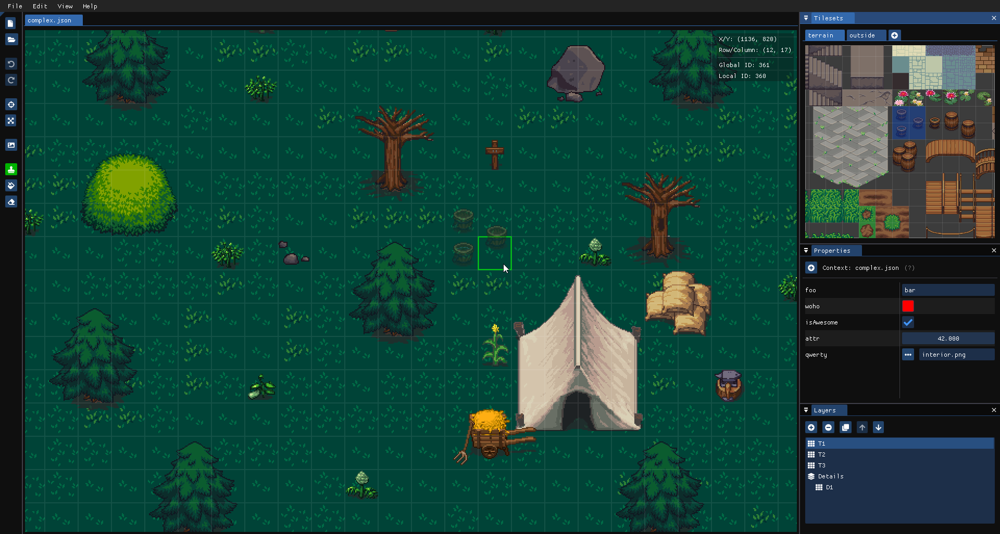

# Tactile

A tilemap editor that aims to be easy-to-use, fast and lightweight. Furthermore, compatibility with
the [Tiled](https://www.mapeditor.org/) map editor has been pursued.

## Aim

The following bullet points describe the goals that guide the design and development of the Tactile
editor.

* Must be easy to learn and get started with.
* Must be easy to use.
* Keep things simple, hide advanced options that are rarely used.
* Well documented and high-quality source code.

## Source code

Tactile is developed with C++20 on Windows using MSVC. The code might be using features that are not
yet available in stable releases of GCC and Clang, which means that Tactile is only available on
Windows, for now. However, with time any C++20 compatible compiler should be able to build the
sources.
