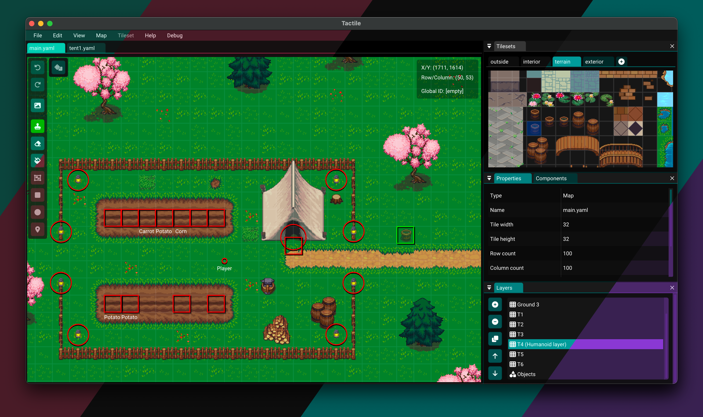

# Tactile

A tilemap editor that aims to be simple, fast and lightweight.

## Aim

* Easy to learn *and* easy to use
* Workflow optimized for common actions
* Well documented and high-quality source code
* Lightweight feel and scalable performance
* Cross-platform: works on Windows, macOS, and Linux

## Features

* Extensive and intuitive undo/redo support
* Various layer types
  * Tile layers
  * Object layers
  * Group layers
* Supports an intuitive and human-readable YAML map format
* Read and write support for the JSON and XML map formats used by [Tiled](https://www.mapeditor.org/)
* Export maps as Godot scenes (see [godot.md](docs/godot.md))
* Intuitive mouse tools
  * Tile stamp tool
  * Eraser tool
  * Bucket fill tool
  * Rectangle tool
  * Ellipse tool
  * Point tool
* Components (attachable bundles of attributes, as commonly found in game engines)
* Properties that can be attached to almost anything: maps, layers, objects, tiles, etc.
  * Vector properties, with support for 2D/3D/4D vectors of both integers and floats
* Tile animations
* Tile compression support, using Base64 encoding with either Zlib or Zstd
* Helpful error messages when things go wrong, e.g. when parsing corrupted maps
* Language support for American English, British English, and Swedish
* Various editor themes, both dark and light
* Easy to install (and uninstall) using the installers bundled along releases

## Documentation

More documentation can be found in the [docs](./docs) directory.
